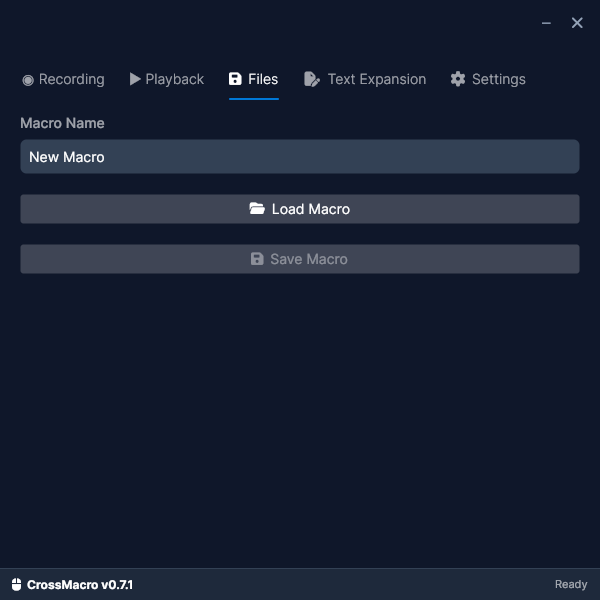

# CrossMacro

A modern mouse and keyboard macro recording and playback application for Linux Wayland and X11.

## Screenshots

| Recording | Playback |
| :---: | :---: |
|  |  |
| **Files** | **Settings** |
|  |  |

## 🖥️ Supported Platforms

- **Linux** (Wayland & X11)
  - Hyprland ✓
  - KDE Plasma ✓
  - GNOME ✓
  - X11 ✓


## 🎯 Features

- **Mouse Event Recording**: Record mouse clicks and movements
- **Keyboard Event Recording**: Record keyboard key presses
- **Playback**: Replay recorded macros with pause/resume support
- **Loop Mode**: Continuously repeat macros with customizable repeat count and delay
- **Speed Control**: Adjust playback speed from 0.25x to 5.0x
- **File Operations**: Save/load macros in .macro format (you choose where to save)
- **Global Hotkeys**: Customizable global hotkey support
  - **F8**: Start/Stop recording
  - **F9**: Start/Stop playback
  - **F10**: Pause/Resume playback
- **System Tray Icon**: Minimize to tray and control macros from system tray (optional)

## ⚙️ Setup & Configuration

> **⚠️ Important**: Complete this setup **before** installing the application.

<details>
<summary><strong>Required Permissions (Click to expand)</strong></summary>

To record and play macros without `sudo`, you must configure permissions:

1. **Add user to input group:**
   ```bash
   sudo usermod -aG input $USER
   ```

2. **Configure uinput rules:**
   ```bash
   echo 'KERNEL=="uinput", GROUP="input", MODE="0660"' | sudo tee /etc/udev/rules.d/99-crossmacro.rules
   ```

3. **Apply changes:**
   ```bash
   sudo udevadm control --reload-rules && sudo udevadm trigger
   ```
   
**Important:** Log out and log back in for group changes to take effect.

</details>

<details>
<summary><strong>GNOME Users Only (Click to expand)</strong></summary>

CrossMacro requires a GNOME Shell extension to capture mouse positions. The extension is **automatically installed** when you first run CrossMacro.

**You need an extension manager to enable it:**

**Fedora:**
```bash
# Usually pre-installed. If missing:
sudo dnf install gnome-extensions-app
```

**Ubuntu/Debian:**
```bash
sudo apt install gnome-shell-extension-manager
```

**Arch Linux:**
```bash
sudo pacman -S extension-manager
```

**Note:** CrossMacro will automatically detect if the extension is missing or disabled and show a warning in the app.

</details>

## 📥 Installation

<details>
<summary><strong>Debian / Ubuntu (.deb)</strong></summary>

```bash
# Download from GitHub Releases, then:
sudo dpkg -i crossmacro-*_amd64.deb
```
</details>

<details>
<summary><strong>Fedora / RHEL (.rpm)</strong></summary>

```bash
# Download from GitHub Releases, then:
sudo rpm -i crossmacro-*.x86_64.rpm
```
</details>

<details>
<summary><strong>Arch Linux</strong></summary>

Available on the [AUR](https://aur.archlinux.org/packages/crossmacro):

```bash
# Using yay
yay -S crossmacro

# Using paru
paru -S crossmacro
```
</details>

<details>
<summary><strong>NixOS</strong></summary>

```bash
nix run github:alper-han/CrossMacro
```
</details>

<details>
<summary><strong>AppImage</strong></summary>

```bash
# Download from GitHub Releases, then run directly:
./CrossMacro-*.AppImage
```
</details>

<details>
<summary><strong>Manual Build</strong></summary>

**Requirements:** .NET 10 SDK

```bash
dotnet run --project src/CrossMacro.UI/
```
</details>


