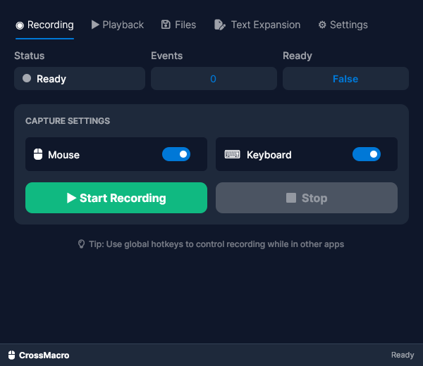
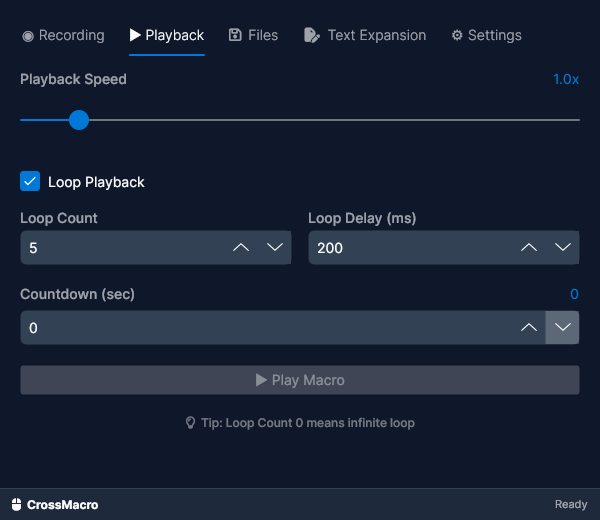
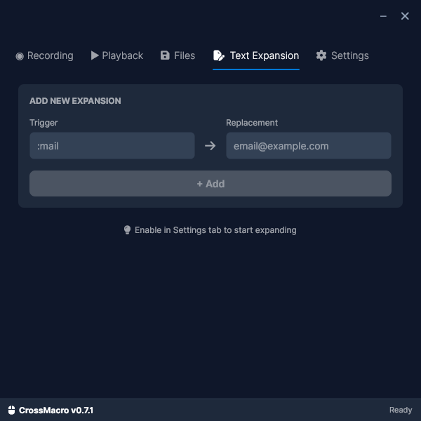
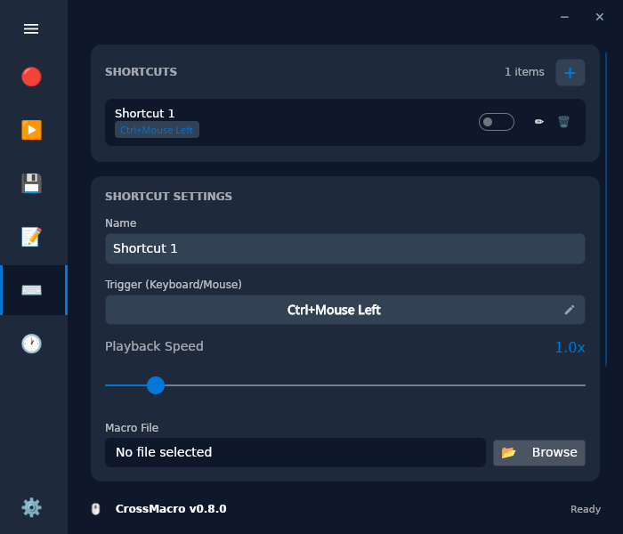
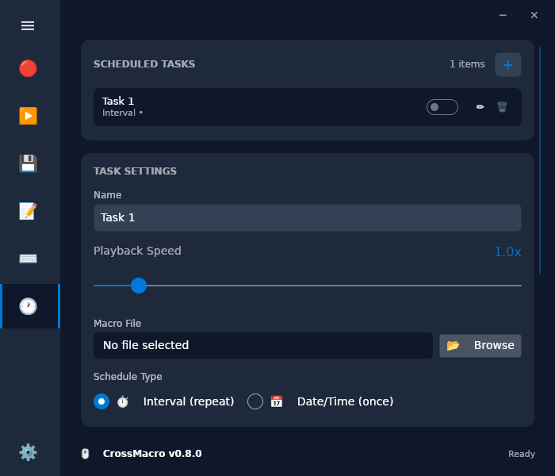
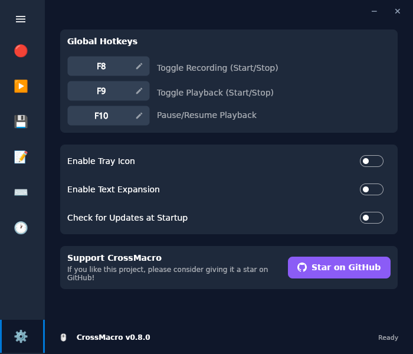

# CrossMacro

[](https://github.com/alper-han/CrossMacro/actions/workflows/pr-check.yml)
[](LICENSE)
[](https://github.com/alper-han/CrossMacro/releases)


A modern mouse and keyboard macro recording and playback application for Linux (Wayland and X11), Windows, and macOS.

## Screenshots

| Recording | Playback | Text Expansion |
| :---: | :---: | :---: |
|  |  |  |
| **Shortcuts** | **Scheduled Tasks** | **Settings** |
|  |  |  |

## 🖥️ Supported Platforms

### Full Support (Absolute Positioning)
- **Linux**
  - Hyprland (Wayland) ✓
  - KDE Plasma (Wayland & X11) ✓
  - GNOME (Wayland & X11) ✓
  - X11 (All other desktop environments) ✓
- **Windows** ✓
- **macOS** ✓


### Partial Support (Relative Positioning)
- **Linux**
  - Other Wayland compositors (fallback mode)

<details>
<summary><strong>What is the difference?</strong></summary>

Relative positioning works flawlessly for reproducing input. However, in **Fallback Mode**, the cursor must **reset to the top-left corner (0,0)** at the start of every recording and playback session.

This is required because standard Wayland security protocols prevent applications from reading the current mouse position on these compositors, so the app must force a known reference point (0,0) to calculate relative movements correctly.

</details>


## 🎯 Features

- **Mouse Event Recording**: Record mouse clicks and movements
- **Keyboard Event Recording**: Record keyboard key presses
- **Text Expansion**: Create text shortcuts for quick insertions (e.g. :mail -> email@example.com)
- **Shortcuts**: Assign macros to keyboard keys, mouse buttons, or combinations for instant execution
- **Scheduling**: Run macros automatically at specific times or intervals
- **Macro Editor**: Powerful built-in editor with undo/redo, smart coordinate capture, and action reordering to fine-tune your macros
- **Playback**: Replay recorded macros with pause/resume support
- **Loop Mode**: Continuously repeat macros with customizable repeat count and delay
- **Speed Control**: Adjust playback speed from 0.1x to 10.0x
- **File Operations**: Save/load macros in .macro format (you choose where to save)
- **Themes**: Customize the look with Classic, Latte, Mocha, Dracula, and Nord themes
- **System Tray Icon**: Minimize to tray and control macros from system tray (optional)
- **Global Hotkeys**: Customizable global hotkey support
  - **F8**: Start/Stop recording
  - **F9**: Start/Stop playback
  - **F10**: Pause/Resume playback

## 📥 Installation

<details>
<summary><strong>Debian / Ubuntu (.deb)</strong></summary>

```bash
# Download from GitHub Releases, then:
sudo apt install ./crossmacro-*_amd64.deb

# Add yourself to the crossmacro group (required for daemon communication)
sudo usermod -aG crossmacro $USER


# Enable and start the background service (important for daemon functionality)
sudo systemctl enable --now crossmacro.service

# Reboot your system for group changes to take effect, then start the app
```

</details>

<details>
<summary><strong>Fedora / RHEL (.rpm)</strong></summary>

```bash
# Download from GitHub Releases, then:
sudo dnf install ./crossmacro-*.x86_64.rpm

# Add yourself to the crossmacro group (required for daemon communication)
sudo usermod -aG crossmacro $USER


# Enable and start the background service (important for daemon functionality)
sudo systemctl enable --now crossmacro.service

# Reboot your system for group changes to take effect, then start the app
```

</details>

<details>
<summary><strong>Arch Linux</strong></summary>

Available on the [AUR](https://aur.archlinux.org/packages/crossmacro):
```bash
# Using yay
yay -S crossmacro

# Using paru
paru -S crossmacro

# Enable and start the background service (important for daemon functionality)
sudo systemctl enable --now crossmacro.service

# After installation, add yourself to the group
sudo usermod -aG crossmacro $USER

# Reboot your system for group changes to take effect, then start the app
```

</details>

<details>
<summary><strong>NixOS</strong></summary>

**Run directly:**
```bash
nix run github:alper-han/CrossMacro
```

> **Note:** `nix run` does not install the background daemon. For it to work, you must manually configure permissions (add yourself to `input` group and set up udev rules) as described in the **AppImage** section below.

**Add to your configuration:**

Add this to your `flake.nix` inputs:
```nix
inputs.crossmacro.url = "github:alper-han/CrossMacro";
```

Then in your NixOS configuration:
```nix
{ inputs, ... }: {
  imports = [ inputs.crossmacro.nixosModules.default ];
  
  programs.crossmacro = {
    enable = true;
    users = [ "yourusername" ];  # Add users who should access CrossMacro
  };
}
```

> **Note:** The NixOS module automatically sets up the daemon service, user, groups, and adds specified users to the `crossmacro` group.

</details>

<details>
<summary><strong>AppImage (Portable)</strong></summary>

This method allows you to run the app without installing anything extra.
Since AppImages run on FUSE, we recommend configuring **User Group Permissions** for the best experience.

> **⚠️ Security Warning:** Adding your user to the `input` group grants your user account direct access to all input devices (keystrokes, mouse moves). This bypasses the secure daemon isolation typically recommended for Linux/Wayland, but is required for the AppImage to function without a system service.

**Setup Instructions (Required) 🛠️**
This allows you to run the app normally (just double-click) without needing sudo.

1. **One-time setup** (Run in terminal):
   ```bash
   # Add udev rule for uinput access
   echo 'KERNEL=="uinput", GROUP="input", MODE="0660", OPTIONS+="static_node=uinput"' | sudo tee /etc/udev/rules.d/99-crossmacro.rules
   
   # Reload rules
   sudo udevadm control --reload-rules && sudo udevadm trigger
   
   # Add your user to input group
   sudo usermod -aG input $USER
   ```
2. **Restart your computer** (Important for group changes to take effect).
3. **Run the App**:
   ```bash
   chmod +x CrossMacro-*.AppImage
   ./CrossMacro-*.AppImage
   ```

</details>

<details>
<summary><strong>Windows</strong></summary>

Download the `.exe` file from [GitHub Releases](https://github.com/alper-han/CrossMacro/releases) and run it directly.

**Alternative (Winget):**
```powershell
winget install -e --id AlperHan.CrossMacro
```

> **Note:** No installation required. The executable is self-contained and doesn't require .NET to be installed.

</details>

<details>
<summary><strong>macOS</strong></summary>

Download the `.dmg` file from [GitHub Releases](https://github.com/alper-han/CrossMacro/releases).

1. Open the `.dmg` file.
2. Drag **CrossMacro** to your **Applications** folder.
3. Keep the app open in Applications folder. (Double check security settings if it doesn't open).

> **Note:** Requires **Accessibility Permissions** to record and play macros. You will be prompted to grant these permissions on first run.

> **⚠️ "App is damaged" Error:**
> If macOS prevents opening the app, run this command in Terminal to bypass Gatekeeper quarantine:
> ```bash
> xattr -cr /Applications/CrossMacro.app
> ```

</details>


<details>
<summary><strong>Manual Build (Development)</strong></summary>

**Requirements:** .NET 10 SDK

```bash
# Clone the repository
git clone https://github.com/alper-han/CrossMacro.git
cd CrossMacro

# Install daemon (Linux only)
sudo ./scripts/daemon/install.sh

# Run the application
dotnet run --project src/CrossMacro.UI/
```

</details>


## ⚙️ How It Works

<details>
<summary><strong>Linux (Wayland)</strong></summary>

CrossMacro uses a **secure daemon architecture** on Wayland:

```
┌─────────────────┐     IPC Socket      ┌──────────────────────┐
│  CrossMacro UI  │ ◄─────────────────► │  CrossMacro Daemon   │
│  (Your User)    │                     │  (System Service)    │
└─────────────────┘                     └──────────────────────┘
                                               │
                                               ▼
                                        /dev/input/* (read)
                                        /dev/uinput  (write)
```

- **Daemon** runs as a system service with `input` group privileges
- **UI** runs as your normal user, communicates via Unix socket
- **Security**: Wayland's strict security model prevents direct input access, so a privileged daemon handles input capture/simulation
- **Position**: Mouse position is obtained via compositor-specific protocols (Hyprland IPC, KDE D-Bus, GNOME Shell Extension)

</details>

<details>
<summary><strong>Linux (X11)</strong></summary>

CrossMacro uses **native X11 APIs** for direct input handling on X11:

```
┌─────────────────────────────────────┐
│         CrossMacro UI               │
│  (Single Process Architecture)      │
└─────────────────────────────────────┘
              │
              ▼
       X11 Server (Xlib)
       ├─ XTest Extension (simulation)
       │  ├─ XTestFakeKeyEvent()
       │  ├─ XTestFakeButtonEvent()
       │  └─ XTestFakeMotionEvent()
       │
       └─ XInput2 Extension (capture)
          ├─ XI_RawKeyPress/Release
          ├─ XI_RawButtonPress/Release
          └─ XI_RawMotion
```

- **Single Process**: No separate daemon required (but daemon is still supported for unified experience)
- **XTest**: Simulates keyboard, mouse, and scroll events directly to X server
- **XInput2**: Captures raw input events from all master devices
- **Position**: `XQueryPointer()` provides accurate cursor position
- **Permissions**: Runs with normal user privileges through X protocol

</details>

<details>
<summary><strong>Windows</strong></summary>

CrossMacro uses **Windows API hooks** for input handling:

```
┌─────────────────────────────────────┐
│         CrossMacro UI               │
│  (Single Process Architecture)      │
└─────────────────────────────────────┘
              │
              ▼
    Windows API (User32.dll)
    ├─ SendInput()      (simulation)
    └─ SetWindowsHookEx() (capture)
```

- **Single Process**: No separate daemon required
- **API Hooks**: Uses low-level keyboard and mouse hooks
- **Permissions**: Runs with normal user privileges

</details>

<details>
<summary><strong>macOS</strong></summary>

CrossMacro uses **CGEvent Taps** (Core Graphics) for input handling:

```
┌─────────────────┐
│  CrossMacro UI  │
└─────────────────┘
        │
        ▼
   Core Graphics (CGEvent)
   ├─ CGEventCreate()     (simulation)
   └─ CGEventTapCreate()  (capture)
```

- **Native Integration**: Uses native macOS APIs for high performance.
- **Permissions**: Requires Accessibility API access (System Settings > Privacy & Security > Accessibility).

</details>

## 🛠️ Troubleshooting

<details>
<summary><strong>GNOME: Extension Required</strong></summary>

CrossMacro requires a GNOME Shell extension to **read mouse position** on Wayland. The extension is **automatically installed and enabled** when you first run CrossMacro.

> **Note:** You need to **log out and log back in** for the extension to take effect after the first installation.

> **Note:** When using AppImage (without the system daemon), this extension is still required for recording mouse positions. The app will handle input simulation directly via the permissions granted.

CrossMacro will show a warning if the extension is not active.

</details>

<details>
<summary><strong>Daemon Not Running</strong></summary>

Check daemon status:
```bash
systemctl status crossmacro.service
```

If not running:
```bash
sudo systemctl start crossmacro.service
sudo systemctl enable crossmacro.service  # Auto-start on boot
```

</details>

<details>
<summary><strong>Permission Denied Errors</strong></summary>

Ensure you're in the `crossmacro` group:
```bash
groups | grep crossmacro
```

If not, add yourself:
```bash
sudo usermod -aG crossmacro $USER
# Reboot your system for group changes to take effect!
```

</details>

<details>
<summary><strong>Polkit Not Available (Minimal/Embedded Systems)</strong></summary>

The daemon requires **polkit** for authorization. If your system doesn't have polkit installed (some minimal or embedded distributions), the daemon will reject all connections.

**Check if polkit is installed:**
```bash
which pkcheck
# or
pkcheck --version
```

**If polkit is not available:**
- The daemon won't work without polkit
- Use the **AppImage** instead with `input` group permissions (see AppImage section above)

> **Note:** Most desktop Linux distributions (Fedora, Ubuntu, Arch, etc.) include polkit by default. This is typically only an issue on minimal server installations or embedded systems.

</details>

<details>
<summary><strong>Keyboard Events Not Recording (Mouse Works)</strong></summary>

Some applications lock input devices to prevent them from being used by other programs. One such application is **GPU Screen Recorder**.

To temporarily stop the conflicting service and record your macros:
```bash
systemctl --user stop gpu-screen-recorder
pkill -9 -f gpu-screen-recorder
```

After you're done recording, you can restart the service with:
```bash
systemctl --user start gpu-screen-recorder
```

</details>
